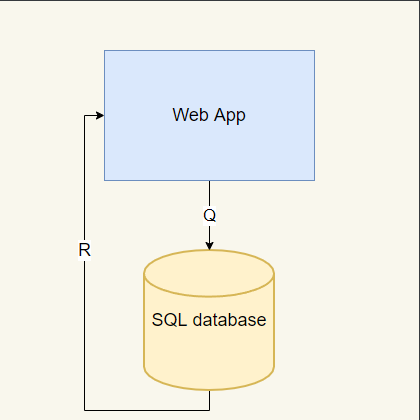

# J-market
## About project
E-commerce platform created using Python3 language and Flask framework.
## Requirements
Requirements can be found inside `requirements.txt` file.
In order to install them please create a new virtual environment and use `pip` manager to install all dependencies. 
### Installation
For Ubuntu 20 LTS:
``
sudo apt install virtualenv
``
``
virtualenv --python=python3 <your_env_name>
``
``
source <your_env_name>/bin/activate
``
``
pip install -r requirements.txt
``
## Architecture

## API Routes
- /login
- /register
- /market
- /logout
- /home

## Unit testing
In order to run the unit tests, you need the `pytest` framework. Install framework using `pip install pytest`.
Tests are gathered in two separated test suites which are located inside test directory.
- 1st suite is based on authentication and access testing. To run this suite use: `pytest -k routes`
- 2nd suite is based on basic database user interaction. To run this suite use `pytest -k modules`

## Objectives
Create a simple e-commerce application where a user can buy or sell the products from the market.
This application allows mew users to join the platform by registering with their e-mail and unique password. Existing users can login and purchase or sell different products if their budget allows them to purchase the item.
All products and users are stored inside a SQL database and are managed by the administrator.
## How to use
After installing all requirements, run the server: 
`export FLASK_APP=run_server`
`flask run`
The application will start locally on the following URL: http://localhost:5000

## Resources
[Flask Course - Python Web Application Development](https://www.youtube.com/watch?v=Qr4QMBUPxWo)